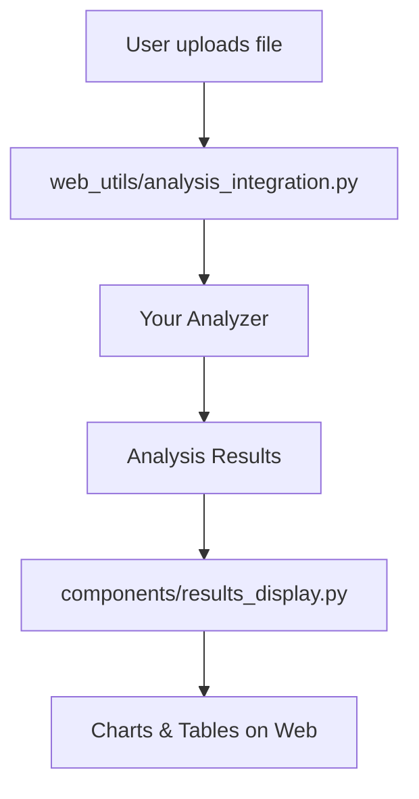

# 📊 Warehouse Analysis Framework - Analyzer Documentation

## 🏗️ **Architecture Overview**

The warehouse analysis framework is built on a modular architecture where each analyzer is a self-contained class that handles specific types of analysis. All analyzers follow consistent patterns for easy extension and integration.

### **Core Design Principles**
- **Modularity**: Each analyzer focuses on a specific domain
- **Consistency**: All analyzers follow the same structural patterns
- **Extensibility**: Easy to add new analysis types
- **Integration**: Seamless connection with web interface
- **Validation**: Robust input validation and error handling

### **Framework Structure**
```
warehouse_analysis_modular/
├── analyzers/              # Core analysis modules
│   ├── order_analyzer.py   # Date-wise order analysis
│   ├── sku_analyzer.py     # SKU profiling & ABC-FMS classification
│   ├── cross_tabulation.py # Cross-tabulation analysis
│   └── __init__.py         # Package exports
├── reporting/              # Output generation
├── utils/                  # Helper functions
└── main.py                # Orchestration script
```

---

## 📋 **Analyzer Specifications**

### **1. OrderAnalyzer** (`order_analyzer.py`)

#### **Purpose**
Analyzes order data at the date and SKU level, providing summaries, percentile calculations, and demand pattern insights.

#### **Input Requirements**
- **Data**: Enriched order DataFrame
- **Required Columns**:
  - `Date`: Order date
  - `Order No.`: Order identifier
  - `Shipment No.`: Shipment identifier
  - `Sku Code`: SKU identifier
  - `Qty in Cases`: Case quantity
  - `Qty in Eaches`: Each quantity
  - `Case_Equivalent`: Calculated case equivalent

#### **Core Methods**

| Method | Purpose | Returns |
|--------|---------|---------|
| `generate_date_order_summary()` | Date-wise aggregation | DataFrame with daily metrics |
| `generate_sku_order_summary()` | SKU-wise aggregation | DataFrame with SKU metrics |
| `calculate_percentile_profile()` | Percentile calculations | DataFrame with percentile data |
| `get_order_statistics()` | Summary statistics | Dictionary with key stats |
| `analyze_demand_patterns()` | Demand pattern analysis | Dictionary with patterns |
| `run_full_analysis()` | Complete analysis | Dictionary with all results |

#### **Output Structure**
```python
{
    'date_order_summary': pd.DataFrame,    # Daily aggregations
    'sku_order_summary': pd.DataFrame,     # SKU aggregations
    'percentile_profile': pd.DataFrame,    # Percentile calculations
    'statistics': dict,                    # Summary statistics
    'demand_patterns': dict                # Pattern analysis
}
```

#### **Key Features**
- **Date Aggregations**: Daily volume, orders, SKUs, customers
- **Percentile Analysis**: Configurable percentile calculations
- **Demand Patterns**: Peak analysis, day-of-week patterns
- **Statistics**: Comprehensive summary metrics

---

### **2. SkuAnalyzer** (`sku_analyzer.py`)

#### **Purpose**
Performs SKU-level analysis including ABC classification (by volume), FMS classification (by movement frequency), and comprehensive SKU profiling.

#### **Input Requirements**
- **Data**: Enriched order DataFrame
- **Required Columns**:
  - `Sku Code`: SKU identifier
  - `Order No.`: Order identifier
  - `Date`: Order date
  - `Case_Equivalent`: Volume metric

#### **Core Methods**

| Method | Purpose | Returns |
|--------|---------|---------|
| `aggregate_sku_metrics()` | Base SKU aggregations | DataFrame with SKU metrics |
| `classify_abc()` | ABC classification by volume | DataFrame with ABC labels |
| `classify_fms()` | FMS classification by frequency | DataFrame with FMS labels |
| `calculate_movement_frequency()` | Movement frequency metrics | DataFrame with frequency data |
| `create_sku_profile_abc_fms()` | Complete SKU profile | DataFrame with classifications |
| `get_sku_statistics()` | SKU distribution stats | Dictionary with statistics |
| `run_full_analysis()` | Complete analysis | Dictionary with all results |

#### **Output Structure**
```python
{
    'sku_profile_abc_fms': pd.DataFrame,   # Complete SKU profile
    'statistics': dict                     # Distribution statistics
}
```

#### **Key Features**
- **ABC Classification**: Volume-based Pareto analysis (70-90% thresholds)
- **FMS Classification**: Movement frequency analysis (Fast/Medium/Slow)
- **2D Classification**: Combined ABC×FMS categories
- **Movement Metrics**: Days active, orders per day
- **Cumulative Analysis**: Percentage calculations

#### **Classification Logic**
- **ABC**: Based on cumulative volume percentage
  - A: 0-70% of volume (high-value items)
  - B: 70-90% of volume (medium-value items)  
  - C: 90-100% of volume (low-value items)
- **FMS**: Based on cumulative order line percentage
  - F: 0-X% of lines (fast-moving)
  - M: X-Y% of lines (medium-moving)
  - S: Y-100% of lines (slow-moving)

---

### **3. CrossTabulationAnalyzer** (`cross_tabulation.py`)

#### **Purpose**
Creates comprehensive ABC×FMS cross-tabulation analysis, providing matrix views and insights into the relationship between volume and movement classifications.

#### **Input Requirements**
- **Data**: Complete SKU profile with ABC and FMS classifications
- **Required Columns**:
  - `Sku Code`: SKU identifier
  - `Total_Order_Lines`: Order line count
  - `Total_Case_Equiv`: Volume metric
  - `ABC`: ABC classification
  - `FMS`: FMS classification

#### **Core Methods**

| Method | Purpose | Returns |
|--------|---------|---------|
| `create_sku_count_crosstab()` | SKU count matrix | DataFrame with counts |
| `create_volume_crosstab()` | Volume matrix | Tuple (volume, percentages) |
| `create_lines_crosstab()` | Order lines matrix | Tuple (lines, percentages) |
| `create_abc_fms_summary()` | Comprehensive summary | DataFrame with all metrics |
| `get_cross_tabulation_insights()` | Analysis insights | Dictionary with insights |
| `run_full_analysis()` | Complete analysis | Dictionary with all results |

#### **Output Structure**
```python
{
    'abc_fms_summary': pd.DataFrame,       # Main summary table
    'sku_count_crosstab': pd.DataFrame,    # SKU count matrix
    'volume_crosstab': pd.DataFrame,       # Volume matrix
    'volume_percentage': pd.DataFrame,     # Volume percentages
    'lines_crosstab': pd.DataFrame,        # Lines matrix
    'lines_percentage': pd.DataFrame,      # Lines percentages
    'insights': dict                       # Key insights
}
```

#### **Key Features**
- **Multi-dimensional Analysis**: SKU count, volume, and order lines
- **Matrix Generation**: ABC×FMS cross-tabulation tables
- **Percentage Calculations**: Relative distribution analysis
- **Insights Generation**: Dominant categories and patterns
- **Summary Tables**: Comprehensive overview tables

---

## 🔧 **Common Patterns & Conventions**

### **Standard Analyzer Structure**
All analyzers follow this pattern:

```python
class YourAnalyzer:
    """Analyzer description."""
    
    def __init__(self, input_data: pd.DataFrame):
        """Initialize with data validation."""
        self.data = input_data
        self.logger = logging.getLogger(self.__class__.__name__)
        self._validate_input_data()
    
    def _validate_input_data(self):
        """Validate input data structure."""
        # Use validate_dataframe() from utils
        
    def your_analysis_methods(self):
        """Specific analysis logic."""
        # Your custom analysis here
        
    def run_full_analysis(self) -> Dict:
        """Required method - complete analysis."""
        # Must return dictionary with results
        return results
```

### **Required Methods**
- `__init__(self, data)`: Initialize with data validation
- `run_full_analysis(self) -> Dict`: Main analysis method
- `_validate_input_data(self)`: Input validation

### **Optional Standard Methods**
- `get_statistics(self) -> Dict`: Summary statistics
- `get_insights(self) -> Dict`: Analysis insights

### **Naming Conventions**
- Classes: `PascalCase` ending with `Analyzer`
- Methods: `snake_case` with descriptive names
- Private methods: Leading underscore `_private_method`
- Constants: `UPPER_SNAKE_CASE`

### **Error Handling**
- Use logging for all operations
- Validate inputs with `validate_dataframe()`
- Handle missing/invalid data gracefully
- Return empty results on failure, don't crash

### **Data Processing Utilities**
Available in `utils/helpers.py`:
- `validate_dataframe()`: Input validation
- `safe_division()`: Division with zero handling
- `classify_abc()`: ABC classification logic
- `classify_fms()`: FMS classification logic
- `normalize_abc_fms_values()`: Clean classification values

---

## 🔌 **Integration with Web Interface**

### **Web Integration Points**
1. **Analysis Integration** (`web_utils/analysis_integration.py`)
2. **Results Display** (`components/results_display.py`)
3. **Parameter Controls** (`components/parameter_controls.py`)

### **Integration Flow**


### **Adding New Analyzer to Web Interface**

#### **Step 1: Update Analysis Integration**
```python
# In web_utils/analysis_integration.py
def _run_your_analysis(self, enriched_data):
    analyzer = YourAnalyzer(enriched_data)
    return analyzer.run_full_analysis()

# Add to run_analysis_pipeline()
your_results = self._run_your_analysis(enriched_data)
combined_results['your_analysis'] = your_results
```

#### **Step 2: Update Results Display**
```python
# In components/results_display.py
def _display_your_analysis(self, analysis_results):
    if 'your_analysis' in analysis_results:
        your_data = analysis_results['your_analysis']
        # Display your results here
        st.subheader("Your Analysis")
        st.dataframe(your_data)

# Add to display_analysis_results()
self._display_your_analysis(analysis_results)
```

#### **Step 3: Update Analyzer Imports**
```python
# In warehouse_analysis_modular/analyzers/__init__.py
from .your_analyzer import YourAnalyzer

__all__ = [
    'OrderAnalyzer',
    'SkuAnalyzer', 
    'CrossTabulationAnalyzer',
    'YourAnalyzer'  # Add your analyzer
]
```

---

## 📈 **Configuration & Customization**

### **Configuration Files**
- `config.py`: Main configuration (thresholds, metrics)
- `config_web.py`: Web-specific settings

### **Customizable Parameters**
- **ABC Thresholds**: A_THRESHOLD, B_THRESHOLD
- **FMS Thresholds**: F_THRESHOLD, M_THRESHOLD  
- **Percentile Levels**: PERCENTILE_LEVELS
- **Aggregation Metrics**: AGGREGATION_METRICS

### **Example Customization**
```python
# In config.py
ABC_THRESHOLDS = {
    'A_THRESHOLD': 70.0,  # Customize A threshold
    'B_THRESHOLD': 90.0   # Customize B threshold
}

# Your analyzer can use these
from config import ABC_THRESHOLDS
```

---

## 🧪 **Testing & Validation**

### **Testing Patterns**
- Unit tests for each analyzer method
- Integration tests with sample data
- Web interface testing

### **Validation Checklist**
- [ ] Input data validation works
- [ ] All required columns present
- [ ] Output format matches specification
- [ ] Error handling works properly
- [ ] Integrates with web interface
- [ ] Performance acceptable with large datasets

### **Sample Test Structure**
```python
def test_your_analyzer():
    # Arrange
    sample_data = create_sample_data()
    analyzer = YourAnalyzer(sample_data)
    
    # Act
    results = analyzer.run_full_analysis()
    
    # Assert
    assert 'expected_key' in results
    assert isinstance(results['expected_key'], pd.DataFrame)
```

---

## 🚀 **Performance Considerations**

### **Best Practices**
- Use vectorized pandas operations
- Avoid loops where possible
- Cache expensive calculations
- Handle large datasets efficiently

### **Memory Management**
- Use `pd.DataFrame.copy()` when modifying data
- Clean up intermediate DataFrames
- Use appropriate data types (int32 vs int64)

### **Scalability**
- Test with realistic data sizes
- Consider chunking for very large datasets
- Profile performance bottlenecks

---

## 📚 **Examples & Use Cases**

### **Common Extension Scenarios**
1. **Customer Analysis**: Customer segmentation, loyalty analysis
2. **Seasonal Analysis**: Seasonal patterns, forecasting
3. **Performance Metrics**: KPI calculations, benchmarking
4. **Cost Analysis**: Cost breakdowns, profitability analysis
5. **Optimization**: Slotting optimization, inventory optimization

### **Real-world Example: Customer Analyzer**
```python
class CustomerAnalyzer:
    """Analyze customer order patterns and segmentation."""
    
    def __init__(self, enriched_data: pd.DataFrame):
        self.enriched_data = enriched_data
        self._validate_input_data()
    
    def segment_customers(self):
        """RFM segmentation analysis."""
        # Recency, Frequency, Monetary analysis
        
    def analyze_customer_patterns(self):
        """Customer ordering patterns."""
        # Seasonality, order frequency, etc.
        
    def run_full_analysis(self):
        return {
            'customer_segments': self.segment_customers(),
            'customer_patterns': self.analyze_customer_patterns()
        }
```

---

## 🔗 **Related Documentation**
- [Adding New Analyzers Guide](ADDING_NEW_ANALYZERS.md)
- [Web Interface Integration](../warehouse_web_app/README.md)
- [Configuration Reference](../config.py)
- [API Reference](../warehouse_analysis_modular/)

## 📞 **Support & Contribution**
For questions about extending the analyzer framework or contributing new analyzers, refer to the development guidelines and use the provided templates for consistency.